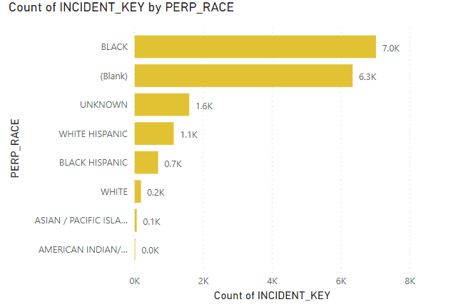
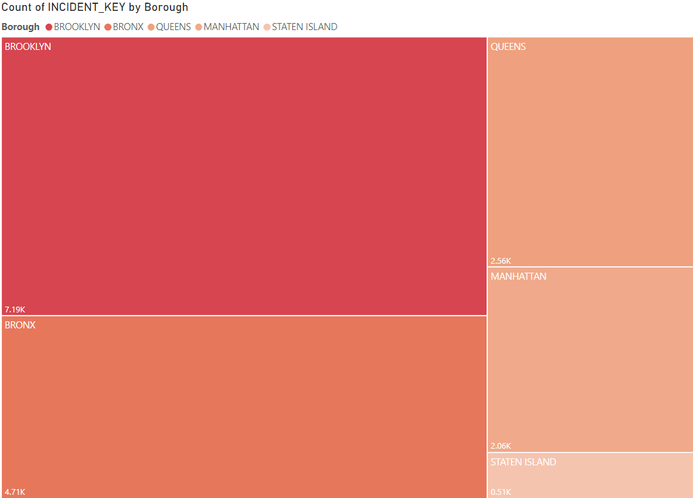
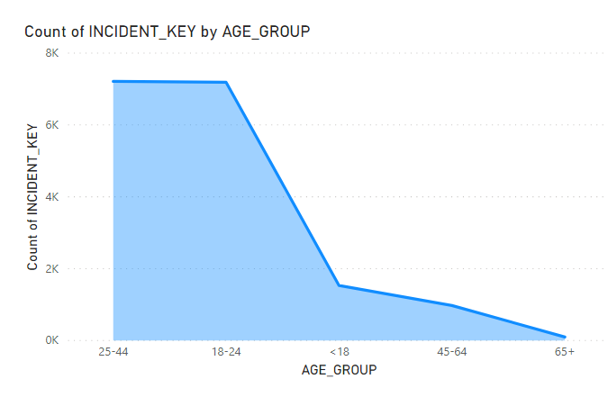

# NYPD_DataWarehouseAndBusinessIntelligence

Data Integration and BI visualizations for NYC Open Data

## Tools Utilized
These are the tools I have utilized for the following project:
* Microsoft PowerBI 
* Microsoft SQL server Management Studio
* SQL Server Developer Edition
* Tableau
* Talend Real-Time Data Platform 7.1

**Data Set Name:** 'NYPD Complaint Data Historic'    [`link to Dataset`](https://data.cityofnewyork.us/Public-Safety/NYPD-Complaint-Data-Historic/qgea-i56i) which contains information on the crime statistics from the 5 boroughs in New York City.

#### **Source:**            
**Dataset Provided by** Police Department (NYPD)

**Dataset Owner:** NYC OpenData

**Abstract :** This dataset includes all valid felony, misdemeanor, and violation crimes reported to the New York City Police Department (NYPD) from 2006 to the end of last year (2019). For additional details, please see the attached data dictionary in the ‘About’ section. 

**Aim** : To find some insights on the NYPD crime data.

# PowerBI Jobs Sample

